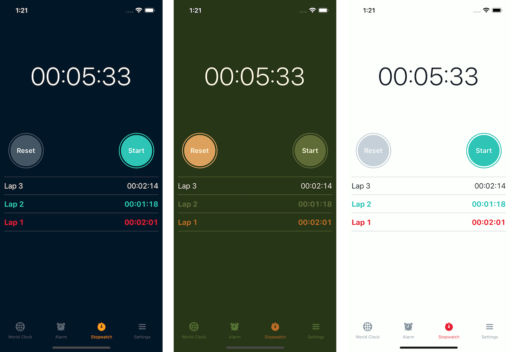
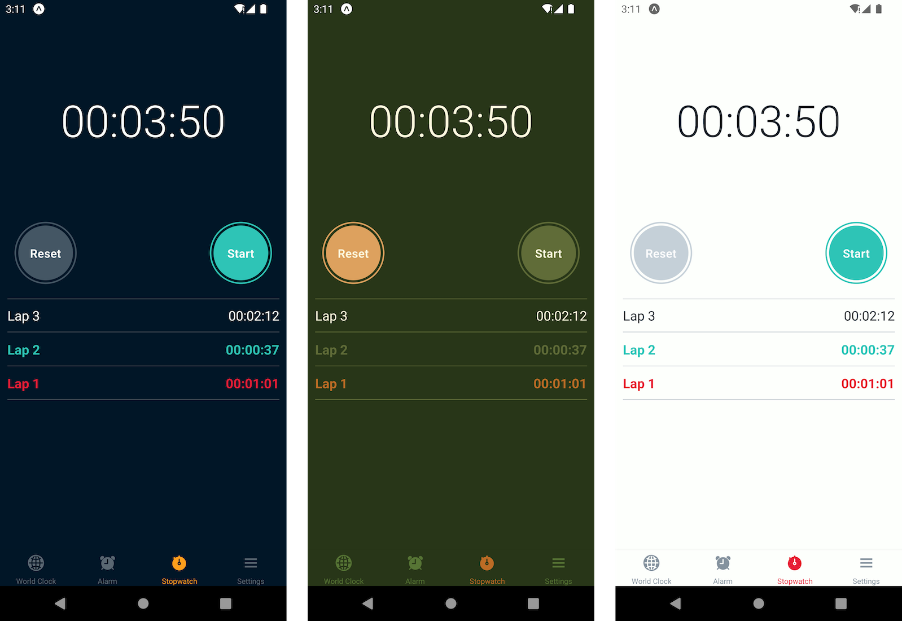

# Expo/React Native Clock App

A minor clone of the iOS clock app, built with Expo.

The primary goal of this app is to serve as an example of how to build a multi-theme React Native app.

Features include:

- A functioning stop watch with lap tracking
- Use system preferred color scheme
- User customizable theme with memory of preference between sessions
- Themed React Navigation v6

### iOS

### Android

### Web

## Install

Pre-requisite: You'll need [Expo](https://expo.dev/) installed on your machine.

Clone the Repo: `git clone https://github.com/ReactNativeSchool/expo-clock-app.git`

Install Depedencies: `yarn install` / `npm install`

## Running the App

- iOS: `yarn ios` / `npm run ios`
- Android: `yarn android` / `npm run android`
- Web: `yarn web` / `npm run web`
